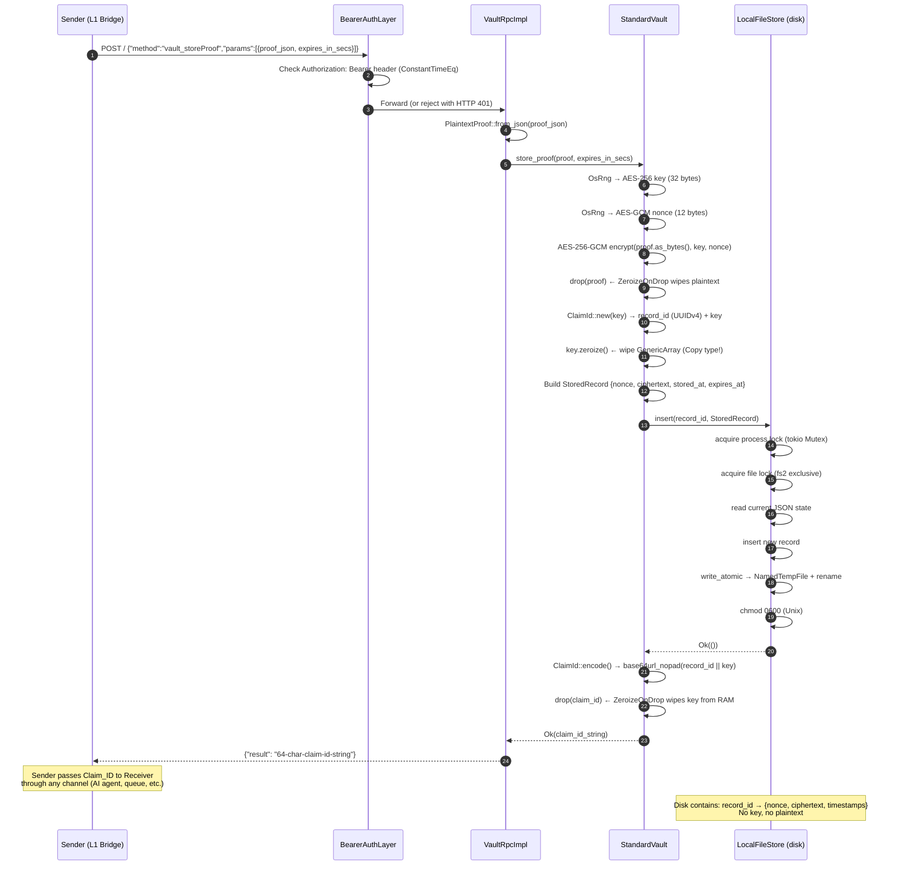
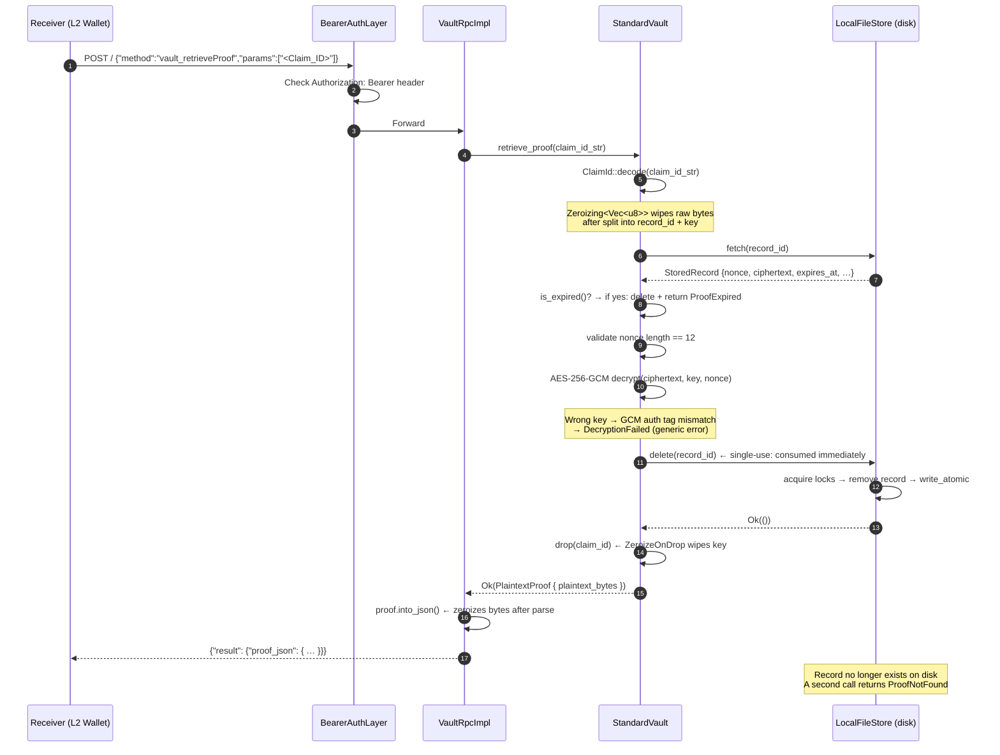
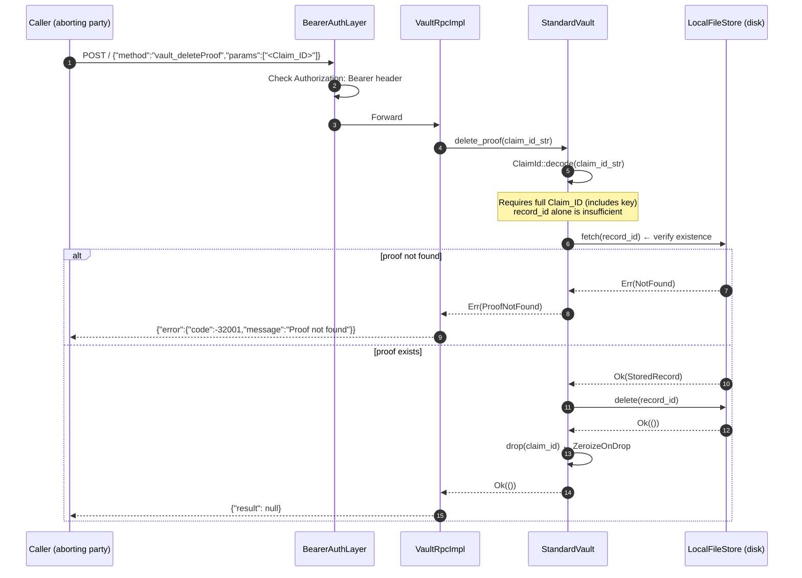
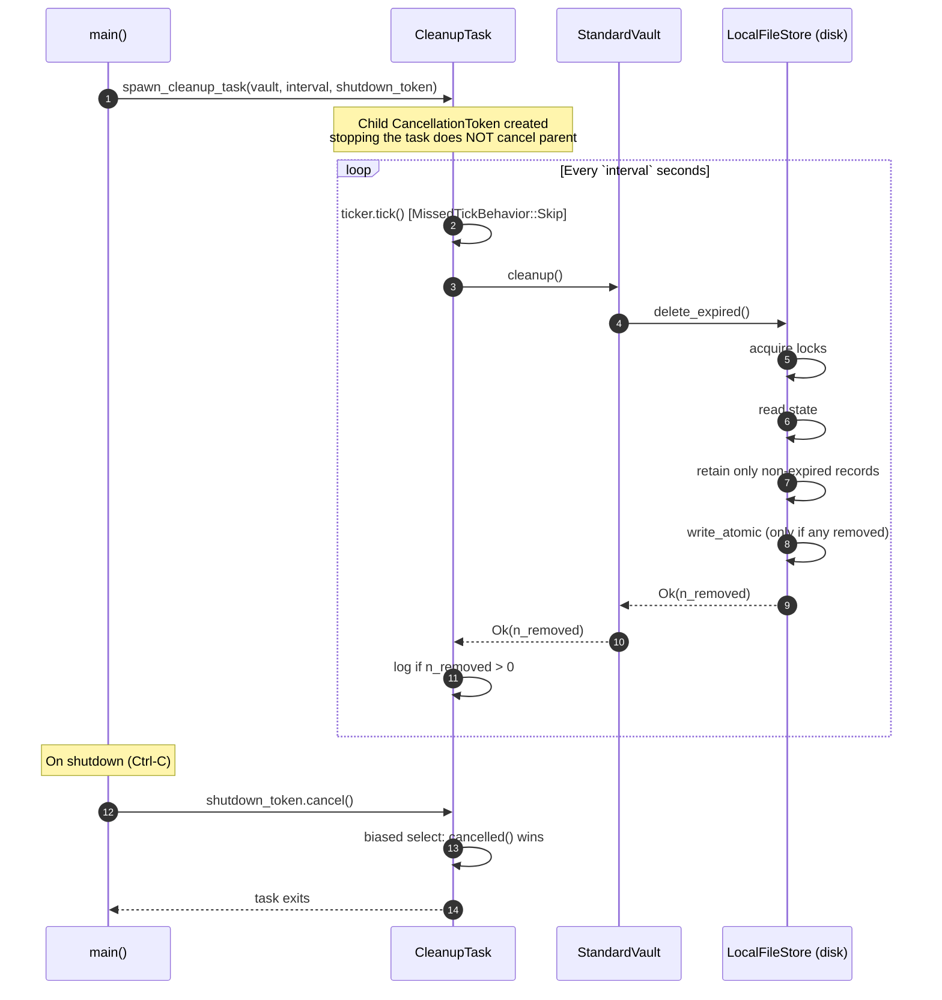
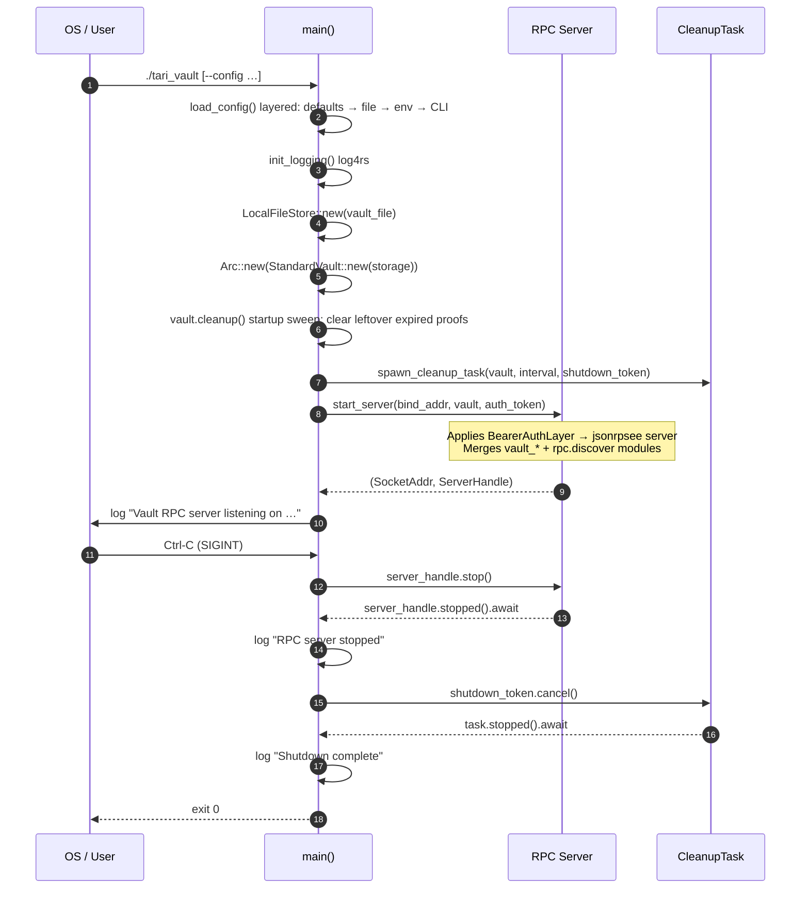

# Data Flows

Sequence diagrams for every significant operation in Tari Vault.

---

## Store Proof (`vault_storeProof`)



---

## Retrieve Proof (`vault_retrieveProof`)



---

## Delete Proof (`vault_deleteProof`)

Abort / cancel flow: the Claim_ID holder discards an unclaimed proof.



---

## Periodic Cleanup Sweep

Background task that purges expired proofs.



---

## Server Startup and Graceful Shutdown



---

## ClaimId Encoding

How 48 bytes become a 64-character token.

```
Input:
  record_id       = [0x3f, 0x25, 0x04, 0xe0, … 16 bytes total] (UUIDv4)
  encryption_key  = [0x7a, 0x3b, 0xc1, 0xd4, … 32 bytes total] (AES-256 key)

Step 1 – Concatenate (in Zeroizing<[u8; 48]> buffer):
  bytes = record_id[0..16] || encryption_key[0..32]
        = 48 bytes

Step 2 – Base64url encode (RFC 4648 §5, no padding):
  Claim_ID = base64url_nopad(bytes)
           = exactly 64 characters
           ┌────────────────────────┬────────────────────────────────────────┐
           │ chars  0 – 21  (22 ch) │ chars 22 – 63  (42 ch)                 │
           │ encodes record_id[16]  │ encodes encryption_key[32]              │
           └────────────────────────┴────────────────────────────────────────┘

Step 3 – Zeroizing buffer is dropped, wiping the 48-byte concatenation.

Decode:
  base64url_nopad decode → Zeroizing<Vec<u8>> (48 bytes)
  split: bytes[0..16] → record_id, bytes[16..48] → encryption_key
  Zeroizing<Vec<u8>> dropped → raw bytes wiped
```
