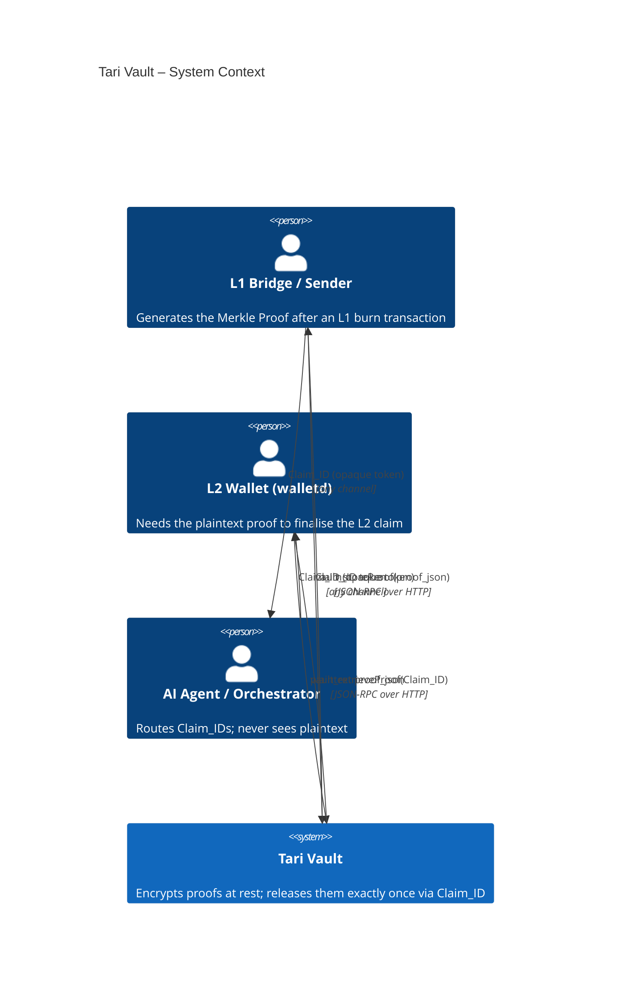
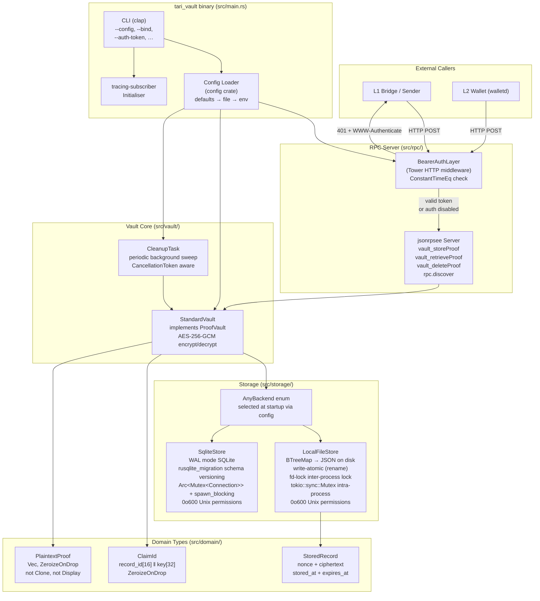

# Architecture Overview

## Purpose

Tari Vault is a **secure intermediary** for handing off L1 Merkle Proofs to L2 wallets.

The core problem it solves: during an L1→L2 bridge, the L1 side generates a Merkle Proof that the L2 wallet needs to finalise the transaction. If this proof is passed through untrusted channels (AI agents, orchestration pipelines, message queues), any participant in that chain can read it. Tari Vault eliminates this risk by:

1. Accepting the proof from the L1 sender.
2. Encrypting it with a freshly generated key that **never touches disk**.
3. Returning a `Claim_ID` token that encodes both a storage lookup key and the decryption key.
4. Releasing the plaintext only to the party that presents the correct `Claim_ID` — once, and then deleting it.

The `Claim_ID` can travel through untrusted channels freely. Without the embedded key, the ciphertext on disk is useless.

---

## System Context



---

## Component Architecture



---

## Module Map

| Module | Path | Responsibility |
|--------|------|----------------|
| `config` | `src/config.rs` | Layered configuration (defaults → file → env → CLI) |
| `domain::PlaintextProof` | `src/domain/proof.rs` | Memory-safe proof wrapper; `ZeroizeOnDrop` |
| `domain::ClaimId` | `src/domain/claim_id.rs` | Key-in-the-ID encoding/decoding; `ZeroizeOnDrop` |
| `domain::StoredRecord` | `src/domain/record.rs` | Serialisable on-disk envelope; TTL check |
| `error` | `src/error.rs` | `VaultError` + `StorageError`; RPC error code mapping |
| `storage::StorageBackend` | `src/storage/backend.rs` | Async CRUD trait (RPITIT) |
| `storage::AnyBackend` | `src/storage/mod.rs` | Enum dispatching to File or SQLite backend |
| `storage::LocalFileStore` | `src/storage/local_file.rs` | File-backed `StorageBackend` implementation |
| `storage::SqliteStore` | `src/storage/sqlite.rs` | SQLite-backed `StorageBackend` implementation |
| `vault::ProofVault` | `src/vault/proof_vault.rs` | Core trait + `StandardVault` impl + `Arc<V>` blanket |
| `vault::CleanupTask` | `src/vault/cleanup.rs` | Periodic TTL sweep background task |
| `auth::BearerAuthLayer` | `src/auth.rs` | Tower HTTP layer; bearer token enforcement |
| `rpc::api` | `src/rpc/api.rs` | `VaultRpc` jsonrpsee trait; request/response types |
| `rpc::discovery` | `src/rpc/discovery.rs` | `rpc.discover` method; compile-time spec embedding |
| `rpc::server` | `src/rpc/server.rs` | Server startup; module merge; auth wiring |

---

## Layered Architecture

```
┌─────────────────────────────────────────┐
│  CLI / Binary (main.rs)                 │  clap, config, tracing
├─────────────────────────────────────────┤
│  HTTP Transport                         │  tokio, hyper (via jsonrpsee)
│    └─ BearerAuthLayer (Tower)           │  subtle::ConstantTimeEq
├─────────────────────────────────────────┤
│  JSON-RPC Layer                         │  jsonrpsee 0.24
│    ├─ vault_* methods                   │
│    └─ rpc.discover                      │  openrpc.json (compiled-in)
├─────────────────────────────────────────┤
│  Vault Core                             │  aes-gcm, zeroize, chrono
│    ├─ ProofVault trait                  │
│    ├─ StandardVault<B>                  │
│    └─ CleanupTask                       │  tokio-util CancellationToken
├─────────────────────────────────────────┤
│  Storage Backend                        │  AnyBackend enum (selected at startup)
│    ├─ LocalFileStore                    │  serde_json, fd-lock, tempfile, uuid
│    └─ SqliteStore                       │  rusqlite (bundled), rusqlite_migration
└─────────────────────────────────────────┘
```

---

## Key Design Decisions

### Key-in-the-ID pattern
The `Claim_ID` is `base64url_nopad(record_id[16] || aes_key[32])`. The vault stores only the ciphertext. The decryption key is **never persisted** — it exists only in RAM during the request and in the `Claim_ID` string held by the caller. See [security-model.md](security-model.md).

### RPITIT async traits
`ProofVault` and `StorageBackend` use Rust 1.75+ `impl Future<...> + Send` in trait definitions, avoiding `async_trait` for the public API while maintaining object safety where needed.

### `Arc<V>` blanket impl
`ProofVault` is implemented for `Arc<V: ProofVault>`, allowing the same vault instance to be shared between the RPC handler and the background cleanup task without cloning the underlying storage.

### Tower middleware before RPC parsing
The bearer token check happens at the HTTP transport layer — before any JSON-RPC parsing. An unauthenticated request never reaches the RPC handler, preventing enumeration of method names.

### Atomic file writes
`LocalFileStore` always writes to a `NamedTempFile` in the same directory as the vault file, then calls `persist()` (an atomic rename). A crash mid-write cannot corrupt the existing vault file.

### SQLite backend and AnyBackend enum dispatch
`SqliteStore` offers O(1) per-operation complexity, WAL-mode concurrency, and a schema managed by `rusqlite_migration`. Because `StorageBackend` uses RPITIT (`impl Future` returns) it is not object-safe, so runtime backend selection is achieved via the `AnyBackend` enum — zero vtable overhead, closed set of variants, clean `main.rs`. `StandardVault<AnyBackend>` is the single concrete type regardless of which backend is configured.
